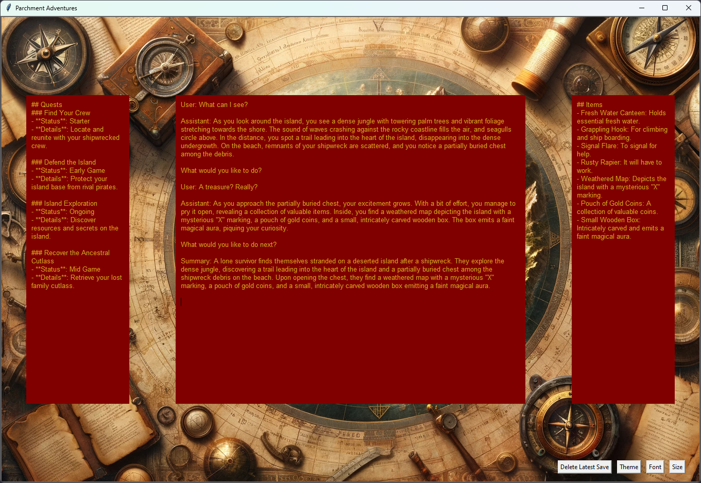
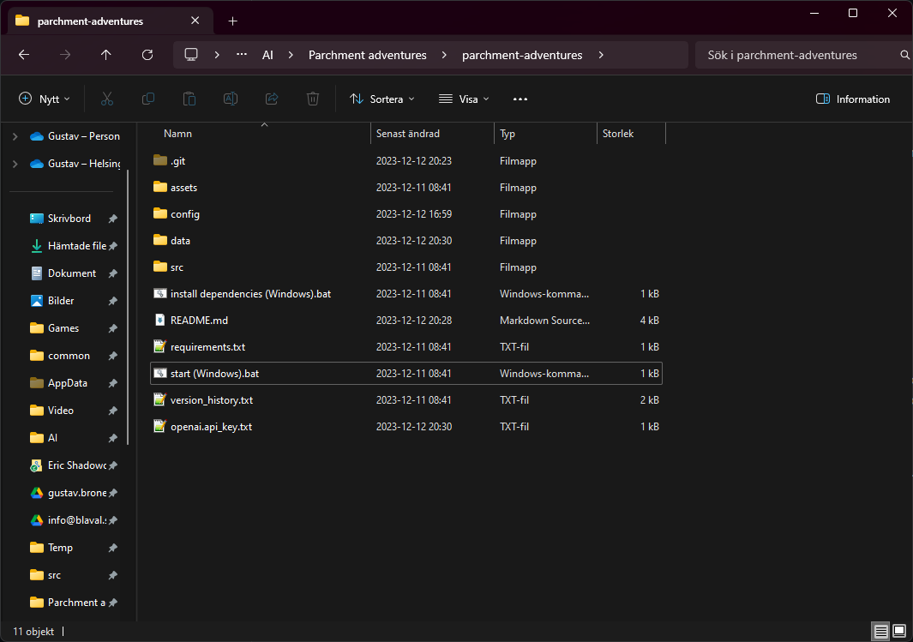
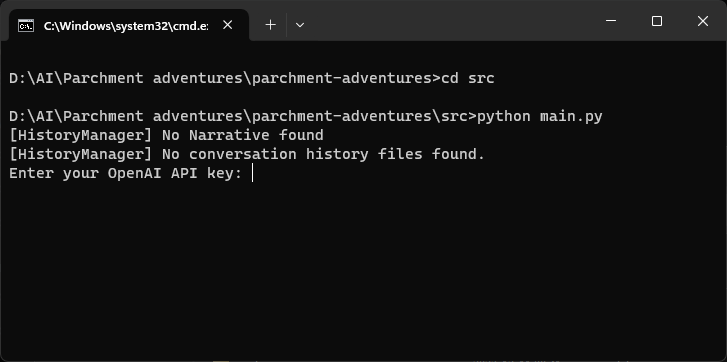

# Parchment Adventures

Parchment Adventures is an extremely versatile text-based adventure game based on generative AI.



# Introduction
Parchment Adventures is inspired by text-based adventure games from the 80s and 90s. The twist is that this game uses modern day generative AI, in this case OpenAI, to create the story and process user commands. This leads to an extremely versatile game where you can basically do anything you want in whatever setting you'd like.

I partially created this game to give my students a more interactive way to practice reading.

# Getting Started
## How to install and run
I understand that for some people, installing a game might feel a bit unfamiliar or daunting. If you get stuck or have some questions, join me on [Discord](https://discord.gg/pWU7NNzq) and I can help you.

### Step 1. Download the game
Download the game at https://github.com/gustavbronelius/parchment-adventures/archive/refs/heads/main.zip.

### Step 2. Extract the game
After downloading, locate the downloaded folder. On most recent versions of Windows, you should be able to right-click the folder and select 'Extract All.' If not, you can use tools like 7-Zip or WinRAR for extraction.



### Step 3. Python
You need to install Python on your computer to run the game. You can download Python on https://www.python.org/downloads/.

### Step 4. Installing and running
After installing Python, you need to navigate to the extracted folder, parchment-adventures-main. In that folder, you need to run these two files:

1. Install dependencies (Windows)
2. start (Windows)

If you are running macOS or Linux, open the Terminal and navigate to the game folder. 

For example, if you downloaded and extracted the game in your Documents folder:
```
cd ~/Documents/Parchment-adventures-main
```

```
pip install -r requirements.txt
```

```
cd src
python main.py
```

### Step 5. OpenAI API Key
The first time you run the game, you will be asked to enter your OpenAI API key (check the black and white console window). 



The API key is used to connect your game to the generative AI. Processing commands with the AI costs about 0.001 to 0.01 USD per command (it depends a bit on how long your game has been running).

Visit OpenAI's API platform https://platform.openai.com/api-keys to get your API key. Ensure you have some funds associated with your account; $5 should be more than enough.

- You can share your API key with friends or family members who would like to play the game. Just make sure that you don't share it online with strangers (they can use your API key to run commands which might quickly use those 5 USD on your account). In case the API key goes escapes into the wild, you can remove it on the openai website.

- This key is vital to running the game as without it, no commands can be processed.

- If you are worried about how much the game is costing to run, you can check usage at this website https://platform.openai.com/usage. Fun fact, during the month long development of this game, I have used about 6 USD (Dec 23).

## Usage
### How to play
Start the game with the file "start (Windows)"


The game is played using the main console window. Write a command and press enter to send it to the narrator. The narrator will continue the story and the game will update your quests, items, etc.

### How to configure
The context of the game is based on a couple of files in the config folder.

- summary.txt
- game_state.txt

#### Summary
The summary states the summary of the history up to the start of the gamne. You can use the summary to easily change the setting of the game. Cowboys in space? Deep ones hiding in Innsmouth? Knights of Ni defending castles?

#### Game state
The game state states the items and quests you start with. Feel free to change this to whatever you'd like. 

### Advanced configurations
- narrator_task_description.txt
- game_state_manager_task_description.txt
- history_manager_task_description.txt

#### Narrator
The narrator is the... narrator of the game. You can check the current task description for what the narrator is tasked to do. Changing the task can lead to unforseen consequences/rewards. Right now, the narrator doesn't have a lot of restrictions. You could add things like magic, 2D side-scrolling universes, weight constraints, etc.

#### Game State Manager
The game state manager is, at the moment, only tasked with controlling items and quests. You could also task it with keeping track of how much weight the player is carrying, how many spells they are currently controlling, and more. Please share your ideas on Discord. 

#### History Manager
You can change the history manager if you want, but I don't really know what for... If you have any suggestions, please get back to me! At the moment it is tasked with summarising the story so that the game can be played endlessly.

# Contact
Join me on [Discord](https://discord.gg/pWU7NNzq) (https://discord.gg/pWU7NNzq) for discussing suggestions, sharing configurations, bugs, and other things.

# Support
You can support me by listening to my music:
- [Blåval](https://youtu.be/CR8DCaJX8Uo)
- [C.K.O.](https://youtu.be/oF1Mfcrwf7Y)
- [Shadowork](https://youtu.be/R8fXrOj0viI)
- [BurningAlien](https://youtu.be/jzIckNYEK94)